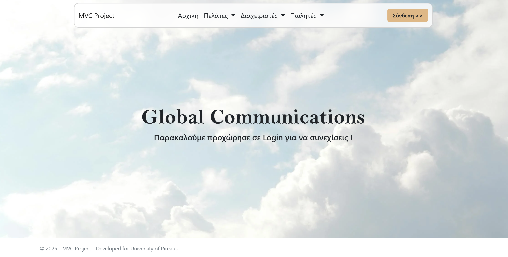
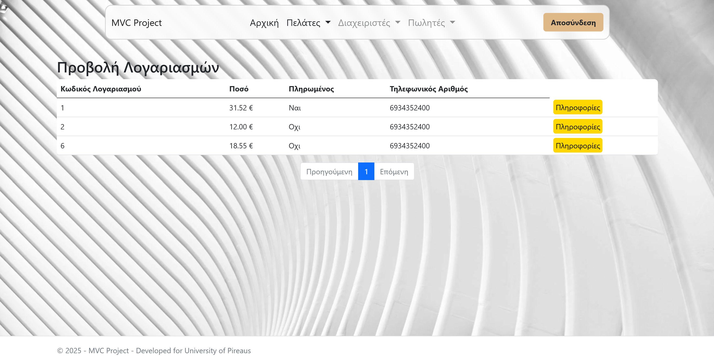
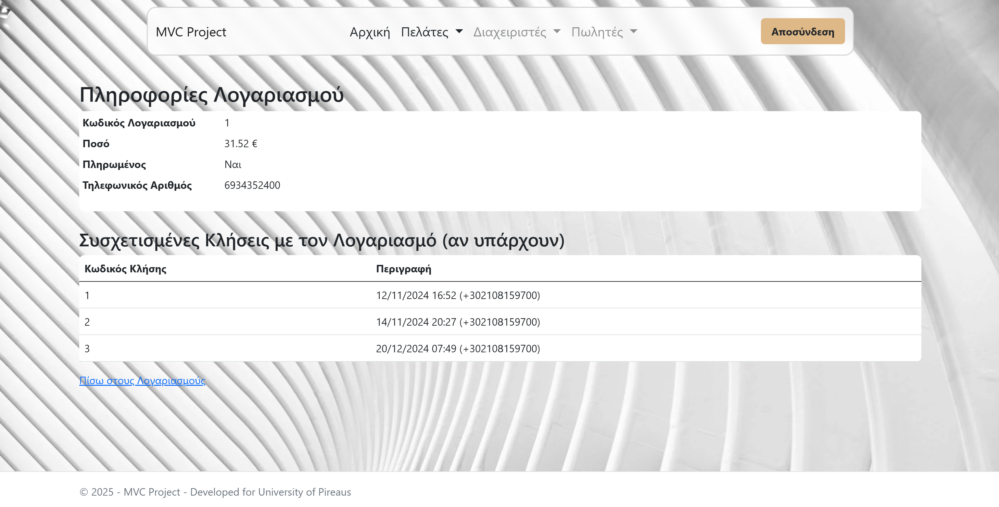
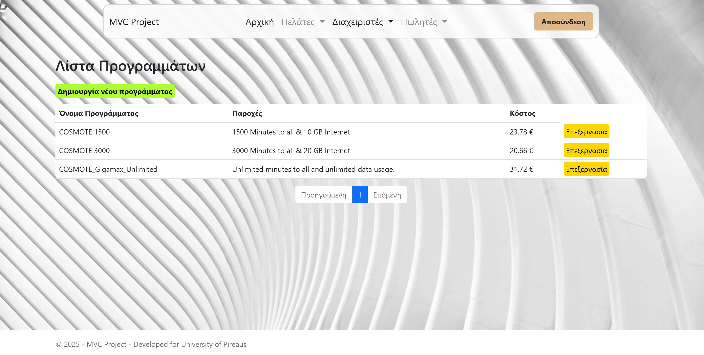
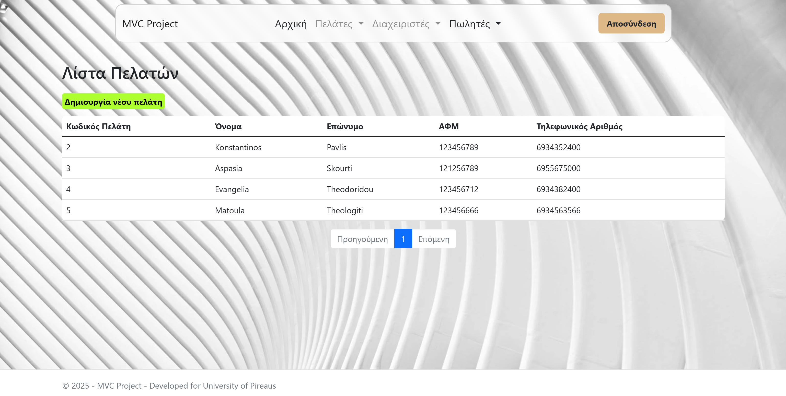
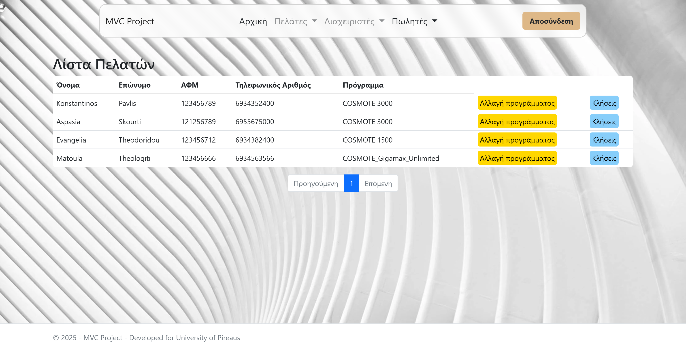

# 📡 Web Application: Global Communications

**This project is a role-based telecommunications management system developed using the MVC (Model-View-Controller) architecture. It supports multiple user roles including Clients, Administrators, and Sellers.**

> ℹ️ This project is not open source and does not grant any usage rights.
> For usage terms and legal information, see [Code Ownership & Usage Terms](#-code-ownership--usage-terms).

## 📖 Overview

Global Communications is a web-based platform designed to simulate the operations of a telecommunications provider. It allows users to manage mobile programs, client accounts, call histories, and payments through a structured and secure interface. The system is modular, scalable, and built with maintainability in mind.

> 📌 The **`resources`** folder contains supporting material such as screenshots, documentation, and database configuration files.

## 🌐 Features

### 🔐 Authentication
- Secure login system for Clients, Administrators, and Sellers
- Role-based access control with dynamic navigation

### 👤 Client Functionality
- View account details and billing history
- Access call history with timestamps and durations
- Make online payments via card
- View and manage subscribed mobile programs

### ⚙️ Administrator Functionality
- Manage mobile programs (create, edit, delete)
- Oversee sales and seller accounts
- Create and manage user accounts

### 💼 Seller Functionality
- Register new clients
- Schedule and manage sales activities
- Assign mobile programs to clients

## 🛠️ Technologies Used

- ASP.NET MVC Framework
- C# for Business Logic
- HTML5
- SQL Server for data persistence
- Bootstrap for responsive UI

## 🎯 Purpose

The purpose of this application is to provide a complete and functional web solution for managing telecommunications services. It enables administrators to oversee mobile programs and user accounts, sellers to onboard clients and assign plans, and clients to view their billing history, call records, and make payments. The project demonstrates a practical implementation of role-based access control, data-driven interfaces, and secure transaction handling within a modern MVC framework. **It is developed solely for academic and research purposes.**

## 📜 User Manual

Detailed instructions on how to use this web application are available on a separate file.  
It includes examples for all the possible user roles (Client, Administrator, Seller).

👉🏼 [User Manual (in greek)](resources/docs/User_Manual_gr.pdf)

## 🧰 Prerequisites

To run this project locally, you will need:

- **Windows 10 version 1809 or later** (Windows 11 recommended)
- **Visual Studio 2022** (version 17.1 or newer)
- **SQL Server Express** and optionally **SQL Server Management Studio (SSMS)**
- **Access to a database schema compatible with the application** (the database schema is provided <a href="resources/database_config/database_schema.sql">here</a>)
- **.NET SDK** (version 8)
- **Developer Mode** enabled in Windows

## 📦 Installation

To set up the project locally:

1. **Clone the repository**
   ```bash
   git clone https://github.com/kpavlis/telco-web-app.git
   cd telco-web-app
2. **Open the project in Visual Studio 2022** using the `.sln` file
3. **Confirm that the following NuGet packages are installed:**
    - Microsoft.EntityFrameworkCore.SqlServer (version **9.0.9**)
    - Microsoft.EntityFrameworkCore.Tools (version **9.0.9**)
    - Microsoft.VisualStudio.Web.CodeGeneration.Design (version **9.0.0**)
    - X.PagedList.Mvc.Core (version **10.5.x**)
4. **Verify Target Framework**
     In your `.csproj` file, ensure the framework is set correctly:
   
     ```xml
     <TargetFramework>net8.0</TargetFramework>

5. **Install** SQL Server Express and optionally SQL Server Management Studio (SSMS)
   - Update the connection string in `appsettings.json` and `LabDBContext.cs (Models folder)` to match your local SQL Server instance
   - Run the provided SQL script `database_schema.sql` to initialize the schema and seed data

6. **Run** the web application from  Visual Studio

## 📷 Screenshots / Video

**_App Screens:_**  
> 
> 
> 
> 
> 
> 


**_Demo Video:_**

> https://github.com/user-attachments/assets/8dd2c9f7-3a12-4fa9-998c-24dd3b6c91a0

# 🔒 Code Ownership & Usage Terms

This project was created and maintained by:

- Konstantinos Pavlis (@kpavlis)
- Theofanis Tzoumakas (@theofanistzoumakas)
- Michael-Panagiotis Kapetanios (@KapetaniosMP)

🚫 **Unauthorized use is strictly prohibited.**  
No part of this codebase may be copied, reproduced, modified, distributed, or used in any form without **explicit written permission** from the owners.

Any attempt to use, republish, or incorporate this code into other projects—whether commercial or non-commercial—without prior consent may result in legal action.

For licensing inquiries or collaboration requests, please contact via email: konstantinos1125 _at_ gmail.com .

© 2025 Konstantinos Pavlis, Theofanis Tzoumakas, Michael-Panagiotis Kapetanios. All rights reserved.
